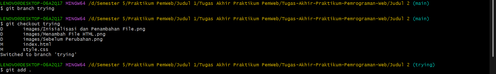
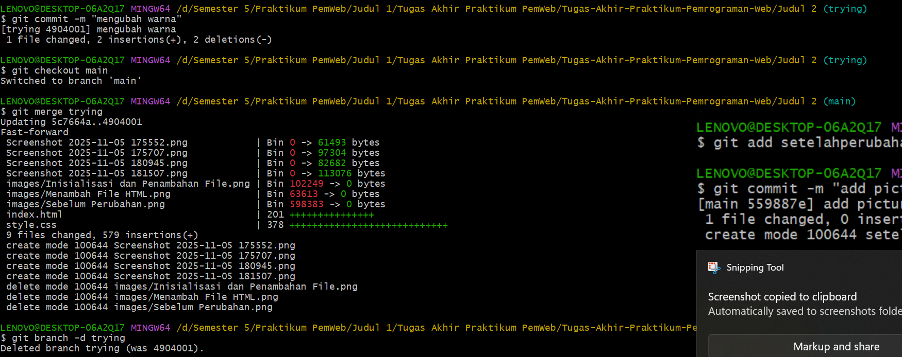
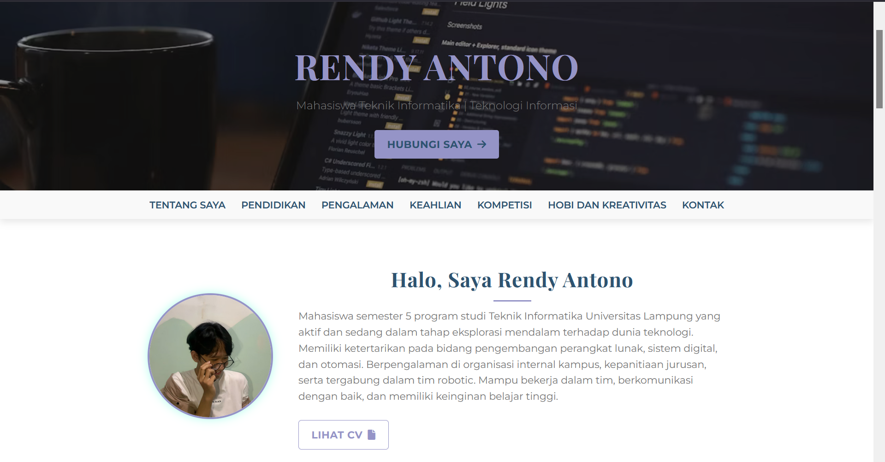

---

## 🧠 Deskripsi Proyek

Proyek ini berisi latihan penerapan konsep HTML dan CSS dalam membangun halaman web yang dinamis dan terstruktur. Setiap perubahan kode dan file didokumentasikan menggunakan **Git** untuk memudahkan tracking versi dan kolaborasi.

Langkah-langkah yang dilakukan antara lain:
- Membuat branch baru (`trying`) untuk menguji perubahan warna tampilan.
- Melakukan modifikasi pada file `index.html` dan `style.css`.
- Menambahkan dan menghapus file gambar pendukung untuk dokumentasi.
- Melakukan commit secara bertahap untuk setiap perubahan agar riwayat pengembangan tetap jelas.

---

## ⚙️ Dokumentasi Proses Git

### 1. Inisialisasi dan Perubahan File

### 2. Menambahkan file dan commit perubahan

### 3. Membuat branch, pindah branch, merge, dan delete branch

### 4. Git add file dan commit -m

### 5. Git Push

### 6. Melihat riwayat commit menggunakan `git log --graph --oneline`

---

## 📝 Riwayat Commit Utama

| Commit Message | Deskripsi Singkat |
|----------------|------------------|
| `Initial commit` | Inisialisasi proyek |
| `nambahin folder` | Menambahkan struktur folder awal |
| `index.html dan style.css` | Menambahkan file utama halaman web |
| `hapus file` | Menghapus file lama yang tidak digunakan |
| `ganti warna` | Mengubah warna tampilan di CSS |
| `Add picture sebelumperubahan` | Menambahkan gambar tampilan sebelum perubahan |
| `add picture setelahperubahan` | Menambahkan gambar tampilan setelah perubahan |
| `simpan perubahan sebelum pull` | Menyimpan commit terakhir sebelum melakukan pull |

---

## 💡 Tujuan Penggunaan Git

Penggunaan Git pada proyek ini bertujuan untuk:
- Mencatat setiap perubahan yang dilakukan.
- Menghindari kehilangan versi kerja sebelumnya.
- Memudahkan pembagian tugas dalam pengembangan web.
- Mendokumentasikan progres kerja secara terstruktur.

---

## 📷 Dokumentasi Perubahan Tampilan

### Sebelum Perubahan

### Setelah Perubahan

---

## 👨‍💻 Dibuat oleh
**Rendy**
Program Studi Teknik Komputer dan Jaringan  
Semester 5 – Praktikum Pemrograman Web  
